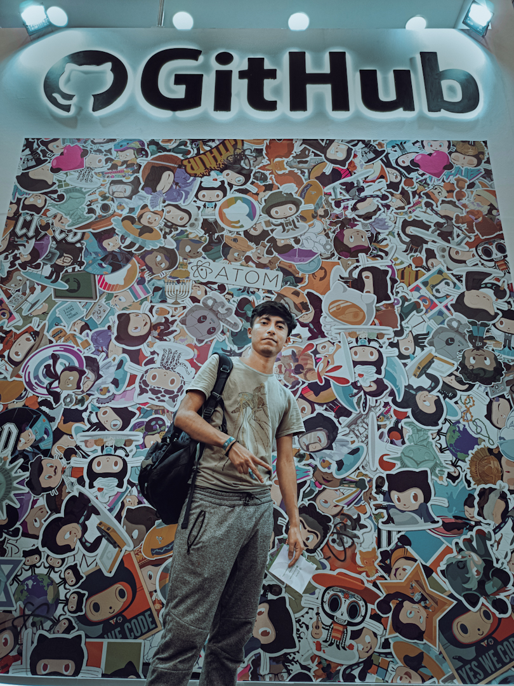

<h1 align="center">
	
</h1>

##  About Me

<h1 align='center'>
	Hi, I'm Jesús Hernández!
	
</h1>

	
	 I'm from Oaxaca México 🇲🇽
	 
	 I am currently working as a freelance web developer
	 
	 I am currently learning English and React-native
	 
	 I am looking to collaborate in any interesting project
	 
	 I am looking for help with hexagonal architecture or clean code, since I would like to gain experience in it
	 
	 Soon I will make a blog
	 
	 I like tacos...
	 
	 You can visit my portfolio at <a href='http://www.jesushernandez.link'>jesushernandez.link</a>

 

---
##  Languages and tools:

	

---

##  My GitHub Stats:

<a align="center" href="#">
		

		&nbsp;
		

</a>

